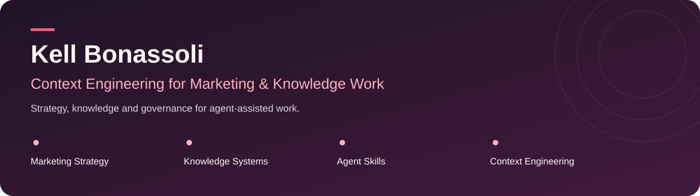
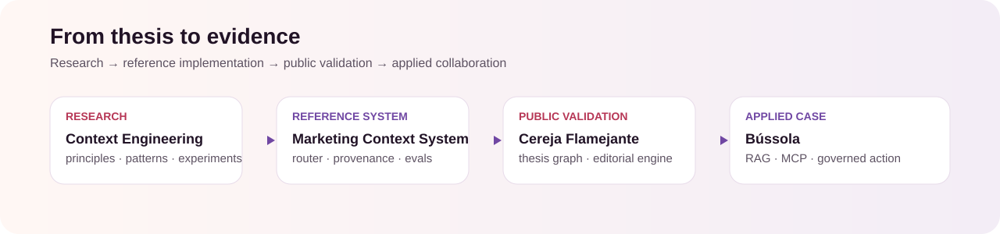
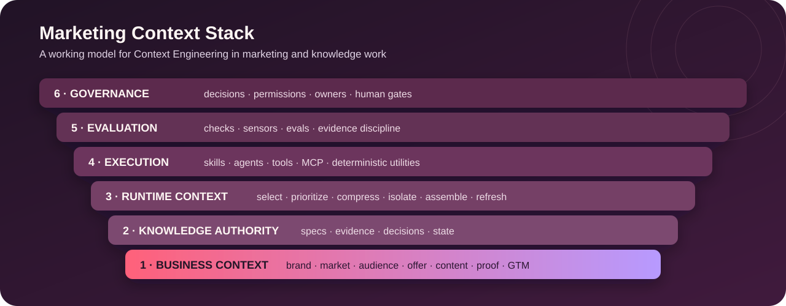

# Hi, I'm Kell Bonassoli

I'm a **marketing leader building and testing context systems for Marketing & Knowledge Work**.

My focus is a practical question:

> **What should an AI agent know, retrieve, trust and use for a task — and how should its work be verified?**

I work on the layer around prompts: **knowledge authority, context routing, agent skills, evidence, evals and human decision gates**.

## What I'm building

| Project | Role in the research |
|---|---|
| [**Context Engineering for Marketing**](https://github.com/eusouakell/context-engineering-for-marketing) | Research lab for principles, patterns, experiments and the **Marketing Context Stack**. |
| [**Marketing Context System**](https://github.com/eusouakell/marketing-context-system) | Executable context selector with provenance and estimated budgets; verification controls documented, benchmark results pending. |
| [**Cereja Knowledge System**](https://github.com/eusouakell/cereja-knowledge-system) | My public knowledge architecture for Cereja: sources, thesis state and editorial decisions; documentation prototype. |
| [**Cereja Editorial Engine**](https://github.com/eusouakell/cereja-editorial-engine) | My proposed editorial workflow: context selection, evidence review and human approval; documentation prototype. |
| [**Bússola**](https://github.com/eusouakell/bussola) | Collaborative Itaú × Google hackathon case exploring RAG, MCP, consent, deterministic logic and governed action. |

[Marketing Skills](https://github.com/eusouakell/marketingskills) is my reference fork of [Corey Haines and contributors' library](https://github.com/coreyhaines31/marketingskills); original upstream authorship belongs to them.

Bússola was developed by a team; **Victor Lopes ([theguitarvity](https://github.com/theguitarvity)) originated and led the repository and technical implementation**. My contribution focuses on strategy, context, research, Responsible AI and narrative.

[Explore the projects and their evidence →](PROJECTS.md)

## Working thesis

The goal is not maximum context.

The goal is **minimum sufficient, authoritative context with measurable effect**.

A reliable context system has two jobs:

1. **establish authority** — what is canonical, current, evidenced or derived;
2. **manage runtime context** — what should actually enter a model call, what should be compressed, isolated or excluded, and why.

I am preparing controlled comparisons to test that thesis between **prompt-only execution**, **full-context dumping**, **routed context** and **routed context + verification**. Model-quality results are published only after the experiments are actually run.

## Selected credentials

[See verified credentials and learning →](CREDENTIALS.md)

## Writing, speaking & work

I write **Cereja Flamejante** and am a speaker with **Escola da Transformação Digital**. My background is in marketing, communication and content strategy, with a B2B / enterprise-technology orientation.

